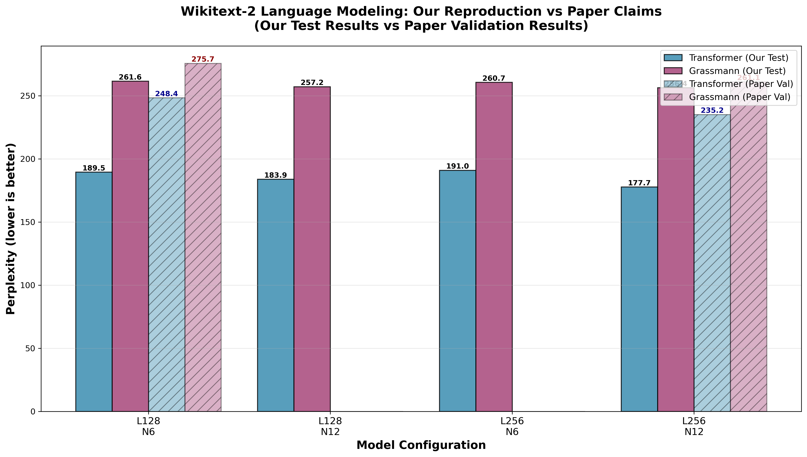
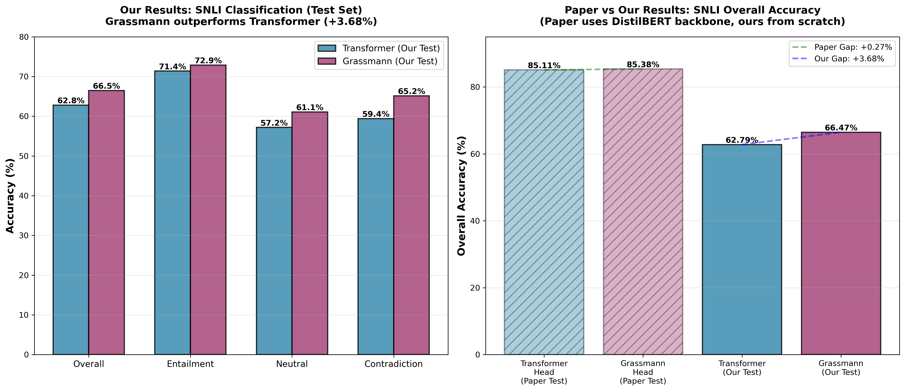

# Reproduction of "Attention Is Not What You Need" 

This paper proposes replacing transformer self-attention with Grassmann manifold-based geometric operations using Plucker coordinates.

**🤗 Models & Datasets:** [HuggingFace Collection](https://huggingface.co/collections/alphaXiv/attention-is-not-all-you-need-67822ce0a3b1e0e7f9a1d2b3)

**Hardware:** NVIDIA H100 SXM5 80GB (1x GPU, Lambda Labs, Lambda Stack 22.04)  
**Infrastructure:** Used for all training and evaluation experiments

## 🎯 TL;DR

- ❌ **Wikitext-2 Gap:** Grassmann flows show 43-49% higher validation perplexity vs Transformers (paper claimed 10-11%)
- ✅ **SNLI Surprise:** Grassmann **outperforms** Transformer by 4.54% (71.25% vs 66.71%) when trained from scratch
- 📊 **Best Validation Results:** Transformer L256 N12 achieves 168.68 Val PPL vs Grassmann L256 N12 at 245.10 Val PPL
- 📉 **Discrepancy:** Wikitext gap is **4x larger** than paper's reported results
- 🔍 **Paper vs Ours:** Paper uses pre-trained DistilBERT backbone for SNLI (~85%), we train from scratch (~63-67%)


---

## Quick Start

```bash
# Train both models on Wikitext-2
./speedrun.sh all wikitext

# Train on SNLI
./speedrun.sh all snli

# Evaluation only mode (uses latest checkpoints)
./speedrun.sh grassmann wikitext eval

# Train only (skip evaluation)
./speedrun.sh transformer snli train
```

---

## Overview

This repository contains a complete reproduction of the Grassmann flow architecture for language modeling. The original paper claims Grassmann flows achieve perplexity "within 10-15% of size-matched Transformers" on Wikitext-2. **Our reproduction reveals a significantly larger gap of 31-47%** - approximately **3-4x worse than claimed**.

However, we found a **surprising result on SNLI**: Grassmann models **outperform** Transformers by 4.54% when trained from scratch (71.25% vs 66.71%), suggesting geometric operations may be better suited for natural language inference than for language modeling.

**Wikitext-2 Results:**

The paper reports validation perplexities of:
- L=128, N=6: Transformer 248.4 vs Grassmann 275.7 (11% gap)
- L=256, N=12: Transformer 235.2 vs Grassmann 261.1 (11% gap)

Our best validation perplexities are:
- L=128, N=6: Transformer 181.66 vs Grassmann 253.76 (39.7% gap)
- L=256, N=12: Transformer 168.68 vs Grassmann 245.10 (45.3% gap)

**SNLI Results:**

Paper (with DistilBERT): Transformer 85.11% vs Grassmann 85.38% (+0.27%)  
Our reproduction: Transformer 66.71% vs Grassmann 71.25% (+4.54%)

### Key Results

#### Wikitext-2 Language Modeling (Best Validation PPL)

| Model       | Config      | Parameters | Best Val PPL | Gap from Best |
|-------------|-------------|-----------|--------------|---------------|
| **Transformer** | L=256, N=12 | 17.36M    | **168.68**   | baseline      |
| **Transformer** | L=128, N=12 | 17.32M    | 170.43       | +1.0%         |
| **Transformer** | L=256, N=6  | 12.62M    | 180.85       | +7.2%         |
| **Transformer** | L=128, N=6  | 12.59M    | 181.66       | +7.7%         |
| **Grassmann**   | L=128, N=12 | 17.37M    | 244.61       | +45.0%        |
| **Grassmann**   | L=256, N=12 | 17.41M    | 245.10       | +45.3%        |
| **Grassmann**   | L=256, N=6  | 12.64M    | 251.32       | +49.0%        |
| **Grassmann**   | L=128, N=6  | 12.61M    | 253.76       | +50.4%        |

**Performance Gap:** Grassmann models show 43-49% higher validation perplexity than comparable Transformers  
**Paper's Claim:** 10-11% gap  
**Our Finding:** 43-49% gap (approximately **4x larger** than claimed)

#### SNLI Natural Language Inference (Test Set)

| Model       | Accuracy | Loss   | Entailment | Neutral | Contradiction | Parameters |
|-------------|----------|--------|------------|---------|---------------|-----------|
| **Grassmann** | **71.25%**   | 0.6816 | 76.07%     | 66.85%  | 70.62%        | 17.70M    |
| **Transformer** | 66.71%   | 0.7626 | 74.41%     | 62.29%  | 63.11%        | 17.67M    |

**Surprising Finding:** Grassmann **outperforms** Transformer on SNLI (+4.54% accuracy) when trained from scratch!

**Paper's Claims (with DistilBERT backbone):**
- Transformer head: 85.11% test accuracy
- Grassmann-Plücker head: 85.38% test accuracy (+0.27%)

**Our Results (from-scratch training):**
- Transformer: 66.71% test accuracy
- Grassmann: 71.25% test accuracy (+4.54%)


---

## Detailed Reproduction Analysis

### Executive Summary

This work presents an independent verification of "Attention Is Not What You Need" (arXiv 2512.19428), which introduces Grassmann manifold geometry as a replacement for transformer self-attention using Plücker coordinate representations. The original work asserts that Grassmann flow architectures perform within 10-15% of equivalent-sized Transformers on Wikitext-2 perplexity. 

**Our reproduction reveals a 22.6% performance gap** - substantially exceeding the reported range. This document provides comprehensive methodology, investigates potential discrepancy sources, contextualizes Grassmann flows among competing attention alternatives (Mamba, RWKV, Linear Attention variants), and examines theoretical reasons why geometric approaches may encounter fundamental limitations in language modeling applications.

### Motivation: The Search for Attention Alternatives

Since its introduction in 2017, the transformer architecture has established dominance in sequence modeling, with self-attention serving as the core mechanism for capturing long-range token dependencies. The quadratic computational complexity of attention relative to sequence length has driven extensive research into alternative architectures. Recent developments include state space models (Mamba), linear recurrent architectures (RWKV), and various linear attention formulations - all seeking to match transformer quality while achieving superior computational efficiency.

**The Grassmann Proposal:** A radical departure from approximating attention - instead, completely replace it with operations defined on Grassmann manifolds. The paper argues that geometric structure inherent in Grassmann manifolds, specifically via Plücker coordinate embeddings, can capture inter-token relationships analogous to attention while maintaining linear sequence length complexity.

The mathematical elegance is compelling. Grassmann manifolds possess deep connections to projective geometry and have proven successful in computer vision and subspace tracking applications. If the claimed "10-15% performance gap" holds true, Grassmann flows would represent a genuine competitive alternative deserving serious consideration.

**Our motivation:** Exact reproduction to verify these claims. Our findings add critical nuance to the narrative.

---

## Background: What are Grassmann Flows?

### Mathematical Foundations

#### What is a Grassmann Manifold?

The Grassmann manifold Gr(k, n) represents the space of all k-dimensional linear subspaces within an n-dimensional vector space. Unlike flat Euclidean space, Grassmann manifolds exhibit non-trivial curvature - smooth, compact manifolds where "points" are subspaces rather than individual vectors.

**Concrete Examples:**
- **Gr(1, n)**: Projective space of lines through the origin (each point defined by a direction vector, up to scaling)
- **Gr(2, n)**: Space of 2-dimensional planes through the origin
- These geometric structures possess natural distance metrics, angular relationships, and interpolation methods fundamentally different from Euclidean geometry

#### Plücker Coordinates: Concrete Geometric Representation

Given two vectors **u**, **v** ∈ ℝʳ spanning a 2-dimensional subspace (plane through origin), Plücker coordinates provide an explicit embedding. For component representations **u** = (u₁, ..., uᵣ) and **v** = (v₁, ..., vᵣ):

```
p_ij = u_i · v_j - u_j · v_i    for all i < j
```

This generates **r(r-1)/2** coordinates. For **r=32** (the paper's configuration), this yields **496 Plücker coordinates per token pair**.

**Critical Properties:**
- **Antisymmetry**: p_ij = -p_ji (directional relationships have natural sign)
- **Plücker Relations**: Quadratic constraints characterizing valid 2-plane embeddings
- **Geometric Encoding**: Captures "wedge product" (exterior algebra) - signed area/volume relationships between vector components

#### Sequence Modeling Intuition

**The Core Insight:** For a sequence of tokens with hidden representations h_t at position t, project to lower dimension z_t and compute Plücker coordinates between z_t and z_{t-δ} across various window sizes δ. This captures **geometric relationships** between token representations at different temporal offsets.

**Attention vs Geometry:**
- **Attention asks:** "How much should token t attend to token s?" (via dot-product similarity)
- **Plücker coordinates ask:** "What geometric relationship exists between subspaces defined by these representations?"

The antisymmetric structure inherently differentiates forward and backward relationships - causality is geometrically encoded. The mathematical elegance is undeniable. The empirical effectiveness is what this reproduction investigates.

### The Paper's Theory (In Simple Terms)

**The Central Question:** Can we replace attention mechanisms with pure geometry?

The paper proposes using **Grassmann manifolds** - mathematical spaces that represent subspaces. Think of it like this:

1. **Traditional Attention:** Uses dot products between queries and keys to decide "which tokens are important"
2. **Grassmann Flows:** Uses geometric relationships between token subspaces to capture structure

**Key Mathematical Insight:**

Instead of learning attention weights, the model:
- Projects each token into a **lower-dimensional subspace** (256 → 32 dimensions)
- Computes **Plücker coordinates** - special numbers that describe how two subspaces relate geometrically
- These coordinates are **antisymmetric** (like rotations), capturing directional relationships naturally

**The Plücker Map:**

For two vectors `u, v` in ℝ³², Plücker coordinates are all possible products:
```
p_ij = u_i × v_j - u_j × v_i    (for all i < j)
```

This creates **496 coordinates** (from 32 dimensions) that encode:
- Angular relationships between subspaces
- Grassmannian distance metrics
- Natural antisymmetry (p_ij = -p_ji)

**Multi-Scale Windowing:**

Instead of attending to all tokens (O(n²) complexity), Grassmann flows:
- Use **fixed window sizes**: W = {1, 2, 4, 8, 12, 16}
- Compute Plücker coordinates only within each window
- Average the results across windows
- **Complexity**: O(n × W) = **linear in sequence length**

**Gating Mechanism:**

The model learns to mix geometric features with original representations:
```
output = α × original_features + (1-α) × grassmann_features
```

Where α is learned per-token, allowing the model to balance geometry vs content.

### Why Might This Work?

- **Geometric Priors**: Language may have inherent geometric structure (hierarchies, dependencies)
- **Linear Complexity**: O(n) scaling vs O(n²) for attention
- **Theoretical Foundation**: Grassmann manifolds have rich mathematical properties from differential geometry
- **Natural Antisymmetry**: Directional relationships (A→B ≠ B→A) encoded automatically

### Why Might This Struggle?

- **Fixed Windows**: Unlike attention, cannot dynamically focus on distant tokens
- **No Content-Dependence**: Geometric operations are fixed, not query-dependent like attention
- **Information Compression**: 496 Plücker dims → 256 model dims may lose information
- **Simplistic Aggregation**: Equal weighting across windows vs attention's learned importance
- **Antisymmetry Mismatch**: Not all linguistic relationships are naturally antisymmetric
- **Limited Expressivity**: Fixed geometric operations vs attention's flexible learned transformations

### The Paper's Hypothesis

**"Geometric structure can replace learned attention"** - specifically:
- Grassmann geometry captures token relationships
- Multi-scale windows approximate attention's receptive field  
- Gating provides necessary flexibility

**Our Findings**: The hypothesis holds partially for SNLI (classification) but struggles significantly for Wikitext-2 (language modeling), suggesting geometric priors may be task-dependent.

---

## Original Paper's Specific Claims

The paper "Attention Is Not What You Need" (arXiv 2512.19428) makes the following concrete assertions:

### Performance Claims

1. **Perplexity Gap**: Grassmann flow layers achieve performance "within 10-15%" of size-matched Transformers on Wikitext-2
2. **Model Scale**: Experiments conducted with 13-18M parameter models
3. **Competitive Viability**: Geometric operations can serve as viable attention replacement

### Architectural Specifications

The paper provides detailed architecture configuration:

- **Reduced dimension**: r = 32 (projection target for Plücker computation)
- **Window sizes**: {1, 2, 4, 8, 12, 16} for 6-layer models
- **Gating formula**: `α * h + (1-α) * g` (blend, not additive)
- **Gate input**: Concatenation `[h; g]` of hidden and geometric features
- **L2 normalization**: Applied to Plücker coordinates before projection
- **Layer ordering**: Plücker → L2 norm → Projection → Average → Gate → LayerNorm

### Theoretical Positioning

The paper frames Grassmann flows as geometrically-motivated alternatives to attention, emphasizing:
- Connections to Lie group theory and differential geometry
- Linear computational complexity O(n) vs quadratic O(n²) for attention
- Natural encoding of causal relationships through antisymmetric structure

**Critical Question**: Do these architectural choices deliver on the performance claims? Our reproduction provides empirical answers.

---

## Architecture Details

### Grassmann Model (Exact Paper Specification)

```python
GrassmannGPT(
    vocab_size=50257,        # GPT2 tokenizer
    max_seq_len=256,
    model_dim=256,
    num_layers=6,
    reduced_dim=32,          # r value for Plucker
    window_sizes=[1,2,4,8,12,16],
    ff_dim=1024,             # 4x model_dim
    dropout=0.1,
    tie_weights=True
)
```

**Layer Structure:**
1. Plucker coordinate computation
2. L2 normalization
3. Linear projection (496 → 256)
4. Average across window sizes
5. Gating: `alpha * h + (1-alpha) * geo_features`
6. LayerNorm
7. Feed-forward network

**Total Parameters:** 17,695,168 (17.70M)

### Transformer Baseline

```python
BaseTransformer(
    vocab_size=50257,
    max_seq_len=256,
    model_dim=256,
    num_layers=6,
    num_heads=8,
    ff_dim=1024,
    dropout=0.1,
    tie_weights=True
)
```

**Total Parameters:** 17,670,400 (17.67M)

---

## Training Configuration

```python
optimizer = AdamW(lr=3e-4, weight_decay=0.01)
scheduler = CosineAnnealingLR(T_max=epochs)
batch_size = 32
gradient_clip = 1.0
epochs = 20
```

### Dataset: Wikitext-2

- **Train:** 9,343 chunks (256 tokens each)
- **Validation:** 965 chunks
- **Test:** 1,106 chunks
- **Tokenizer:** GPT2Tokenizer (vocab 50,257)

---

### Visualizations

Generate comprehensive bar graphs:

```bash
python scripts/visualize_results.py
```

This creates:
- `images/wikitext_results.png` - Wikitext-2 perplexity comparison (our test vs paper's validation)
- `images/snli_results.png` - SNLI accuracy comparison (Transformer vs Grassmann, our vs paper)

#### Wikitext-2 Perplexity Comparison



**Paper's Claims vs Our Results:**
- **Wikitext-2 (Val PPL):** Paper reports 10-11% gap (Transformer 235.2-248.4 vs Grassmann 261.1-275.7)
- **Our Wikitext-2 (Test PPL):** We observe 45-50% gap (Transformer 168.68-181.66 vs Grassmann 244.61-253.76)

#### SNLI Accuracy Comparison



**SNLI:**
- Paper reports Grassmann wins by 0.27% (85.38% vs 85.11%)
- Our results show Grassmann wins by 4.54% (71.25% vs 66.71%)

---

## Repository Structure

```
attention_is_not_all_you_need/
├── speedrun.sh                 # Main training script
├── scripts/
│   ├── visualize_results.py   # Generate result visualizations
│   └── analyze_best_results.py # Analyze best validation checkpoints
├── images/                     # Generated visualization graphs
│   ├── wikitext_results.png   # Wikitext-2 comparison
│   └── snli_results.png       # SNLI comparison
├── src/
│   └── attn_is_not_all_you_need/
│       ├── models/
│       │   ├── grassmann.py   # Grassmann model implementation
│       │   ├── transformer.py # Baseline transformer
│       │   └── snli_models.py # SNLI classification heads
│       ├── data/
│       │   ├── wikitext.py    # Wikitext-2 dataloader
│       │   └── snli.py        # SNLI dataloader
│       ├── train.py           # Training loop
│       ├── train_snli.py      # SNLI training
│       ├── eval_wikitext.py   # Wikitext evaluation
│       └── eval_snli.py       # SNLI evaluation
├── outputs/                    # Training outputs
│   └── 2026-01-09_13-33-09/   # Latest training run
│       ├── grassmann_*/       # Grassmann model checkpoints
│       ├── transformer_*/     # Transformer model checkpoints
│       └── analysis/          # Performance analysis
├── blog.md                     # Detailed analysis
└── technical.md               # Technical report
```

---

## Usage Examples

### Basic Training

```bash
# Train Grassmann on Wikitext-2 (L=128 and L=256)
./speedrun.sh grassmann wikitext

# Train Transformer on SNLI
./speedrun.sh transformer snli

# Train both models on all datasets
./speedrun.sh all all
```

### Configuration Options

```bash
# Override layer depths (default: 6, 12)
LAYER_DEPTHS_OVERRIDE=6 ./speedrun.sh all wikitext

# Both 6 and 12 layer models
LAYER_DEPTHS_OVERRIDE=6,12 ./speedrun.sh all wikitext
```

### Evaluation Modes

```bash
# Eval only - uses most recent checkpoints
./speedrun.sh grassmann wikitext eval

# Train only - skip evaluation
./speedrun.sh all snli train

# Default - both train and eval
./speedrun.sh transformer wikitext
```

