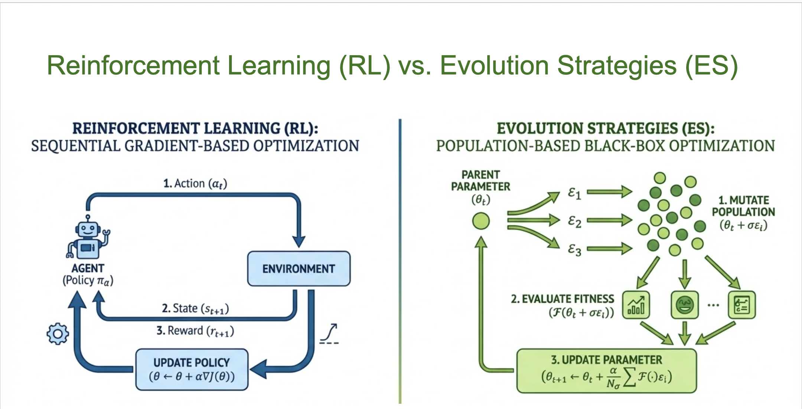
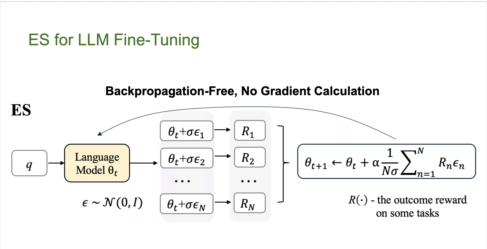
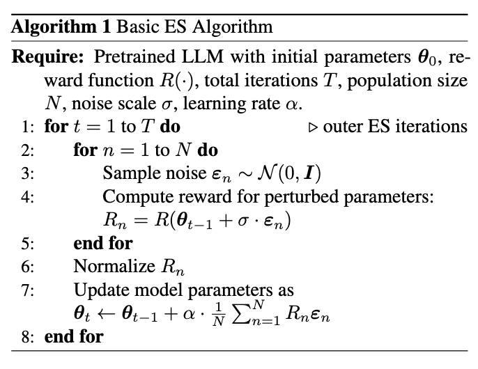
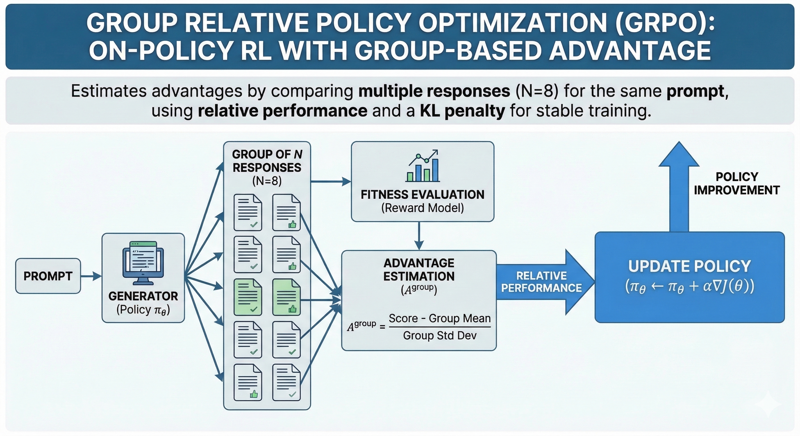
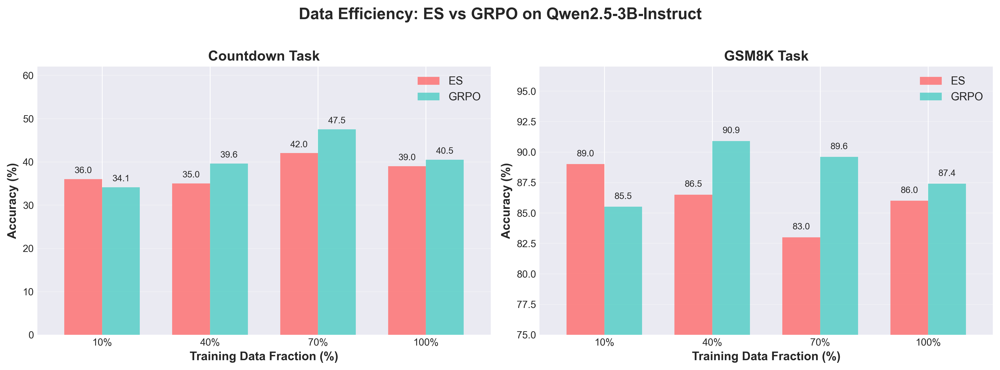
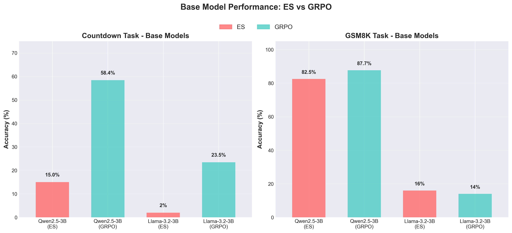
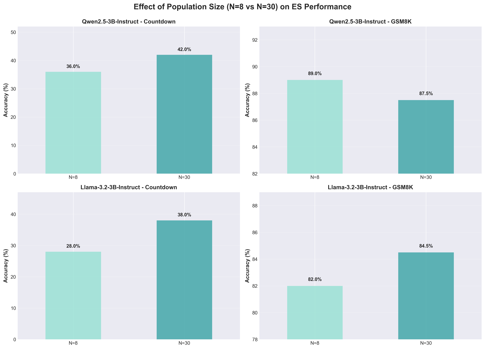
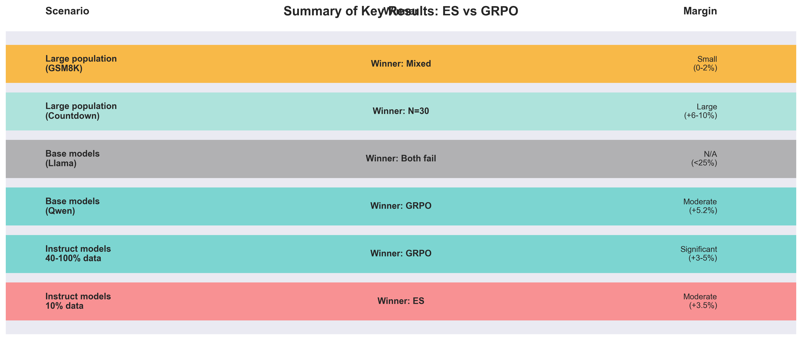

# Introduction

Reinforcement learning (RL) has become the dominant paradigm for fine-tuning large language models (LLMs) on tasks with verifiable outputs. Methods like PPO, DPO, and GRPO (Group Relative Policy Optimization) power many state-of-the-art systems. But there's an alternative approach that's been quietly gaining traction: **Evolution Strategies (ES)**.

ES offers a fundamentally different way to optimize neural networks. Instead of computing gradients through backpropagation, ES treats the model as a black box and optimizes it using only forward passes and reward signals. This approach has surprising benefits: it's simpler to implement, parallelizes well, and can be more sample-efficient in certain regimes.

<div align="center" style="margin: 2em 0;">

<p><em>Comparison of Evolution Strategies (ES) and Reinforcement Learning (RL) optimization approaches. ES perturbs model weights with random noise and updates based on reward signals, while RL uses gradient-based policy optimization.</em></p>
</div>

Despite the theoretical appeal of ES, a key question remains: **how does ES actually perform compared to RL when fine-tuning modern LLMs?** Specifically:

- Is ES more data-efficient than RL?
- Does ES work better on base models or instruction-tuned models?
- How does scaling the population size affect ES performance?

To answer these questions, we conducted a comparison of ES and GRPO across two reasoning tasks: **Countdown** (an arithmetic puzzle game) and **GSM8K** (grade-school math word problems). We tested on 3B parameter models (Qwen2.5 and Llama-3.2 - Base + Instruct) with varying training data fractions and population sizes.

Our contributions are:

- A controlled empirical comparison of ES vs GRPO across multiple data regimes
- Analysis of how ES and GRPO perform on base vs instruction-tuned models
- Insights on population size scaling for ES at the 3B model scale

You can find our eval rollouts and dataset used at this [link](https://huggingface.co/collections/alphaXiv/es-grpo).
# Tasks & Dataset

We evaluate ES and GRPO on two mathematical reasoning tasks that differ in structure and difficulty.

## Countdown Task

The Countdown task is inspired by the Numbers round of the British game show *Countdown*. Given a set of numbers and a target number, the model must construct an arithmetic expression using the given numbers exactly once to reach the target.

**Example:**

```
Numbers: [3, 6, 25, 50, 75, 100]
Target: 952
```

The task requires:

- Combining multiple numbers with arithmetic operations
- Using each number exactly once
- Producing a valid expression that evaluates to the given target

We use a dataset of 2,000 Countdown problems and evaluate models on their ability to generate responses in the format:

```
<think>[reasoning process]</think>
<answer>[arithmetic expression]</answer>
```

The reward function gives:

- **1.0 points** if the expression uses all numbers exactly once and evaluates to the target
- **0.1 points** for proper formatting (presence of appropriate tags)
- **0.0 points** for invalid or incorrect answers

<div align="center" style="margin: 2em 0;">

<p><em>Illustration of how rewards are computed in Evolution Strategies. Each perturbed model is evaluated on a batch of training data, producing rewards that guide the parameter update direction.</em></p>
</div>

Our choice of hyperparameters for GRPO version of this task was inspired by [this repository](https://github.com/Jiayi-Pan/TinyZero/tree/main) which used a similar setup for training on Countdown and the ES version hyperparameters were taken directly from the original [ES paper](https://www.alphaxiv.org/abs/2509.24372) which also used Countdown as a testbed.

## GSM8K Task

GSM8K (Grade School Math 8K) is a dataset of  approx 8,000+ grade-school level math word problems requiring multi-step reasoning. Problems involve arithmetic operations, unit conversions, and logical reasoning.

**Example:**

```
Question: Natalia sold clips to 48 of her friends in April, and then she 
sold half as many clips in May. How many clips did Natalia sell altogether 
in April and May?

Answer: Natalia sold 48/2 = 24 clips in May.
Natalia sold 48+24 = 72 clips altogether in April and May.
#### 72
```

Models must generate step-by-step reasoning and output the final answer after `####`. The reward function checks both formatting and numerical correctness as follows:

- **1.0 points** if the final answer is correct
- **0.1 points** if the formatting is correct (presence of `####` and a numerical answer)
- **0.0 points** for incorrect answers

We use a subset of the GSM8K training set (ranging from 10% to 100%) for fine-tuning, reserving a consistent 200-sample test set for evaluation.

## Data Splits

To test data efficiency, we created four training splits for each task:

- **10%**: 200 samples (Countdown), ~700 samples (GSM8K)
- **40%**: 800 samples (Countdown), ~2,800 samples (GSM8K)
- **70%**: 1,400 samples (Countdown), ~4,900 samples (GSM8K)
- **100%**: 2,000 samples (Countdown), ~7,000 samples (GSM8K)

For fair comparison, we ensured that ES and GRPO evaluated approximately the same number of total samples across training. With batch size $b$, population/group size $N$, and $T$ iterations:

$$
\text{Total Evaluations} = T \times N \times b
$$

Keeping the total number of sample evaluations the same between ES and GRPO ensures that any  performance differences reflect the amount of data used rather than samples seen.
For eg, with $T=100$ iterations, $N=8$ population/group size, and $b=16$ batch size, both methods evaluate 12,800 samples in total. This allows us to isolate the effect of the training method itself on data efficiency and performance. 

Our choice of hyperparameters for GRPO version of this task was inspired by this [HuggingFace article](https://huggingface.co/blog/Weyaxi/engineering-handbook-grpo-lora-with-verl).
# Methods

## Evolution Strategies (ES)

Evolution Strategies optimize model parameters by sampling random perturbations and updating in the direction of high-reward perturbations. The implementation follows the canonical ES algorithm:



**Key hyperparameters (and what we used):**

- $\sigma = 0.001$ (noise standard deviation)
- $\alpha = 0.0005$ (learning rate)
- $N \in 8, 30$ (population size)
- $T \in 100, 200$ iterations

ES has several appealing properties:

- **No gradients needed**: Only requires forward passes and reward evaluation
- **Sync-free parallelism**: All $N$ evaluations can run in parallel without synchronizations as in gradient based approaches (since there are none)
- **Exploration**: Tunable exploration through noise injection generating n-diverse perturbations

In practice, the algorithm is implemented using several tricks to ensure scalability. These are described in more detail in [the paper](https://www.alphaxiv.org/abs/2509.24372).

## Group Relative Policy Optimization (GRPO)

GRPO is a modern on-policy RL algorithm that estimates advantages by comparing responses within a group. For each prompt, GRPO generates $N$ responses and uses their relative performance to compute advantages.

Our GRPO implementation uses:

- Full-parameter fine-tuning (LoRA only for 100% dataset experiments)
- $N=8$ rollouts per prompt
- $\text{lr}=3\times10^{-6}$ learning rate
- KL divergence penalty (coef=0.001) to prevent drift from reference policy
- FSDP (Fully Sharded Data Parallel) for distributed training


We use VERL (a scalable RL training framework) for our GRPO experiments, which provides efficient implementations of vLLM-based rollout generation and FSDP-based training.

## Models

We compare ES and GRPO on two model families at the 3B parameter scale:

- **Qwen2.5-3B** (base and instruct)
- **Llama-3.2-3B** (base and instruct)


We chose these models, owing to their availability at 3B scale which suited for consumer GPUs and different training characteristics since qwen models are know to be more robust to instruction tuning and have better mathematical capabilities than llama models.

For base models, we use custom chat templates to format prompts appropriately, as they lack built-in instruction-following capabilities. The use of chat template is necessary as mentioned in [DeepSeek-R1](https://www.alphaxiv.org/abs/2509.24372). We made use of a simple prompt template owing to [SimpleRL](https://www.alphaxiv.org/abs/2503.18892) results

# Training Setup

## Hardware Details
- All experiments were conducted on  **8x A100 (80GB)** GPUs on Lambda Labs running Lambda Stack 22.04. 
- Full-parameter fine-tuning was used for all experiments, with the exception of the 100% dataset experiments which used LoRA (Low-Rank Adaptation, rank=64, alpha=32) for memory efficiency.

## ES Configuration

ES training used the accelerated implementation (`es_fine_tuning_gsm8k_accl.py`, `es_fine-tuning_countdown_accl.py`) with:

- vLLM for fast inference
- Ray for distributed coordination
- Multiple vLLM engines (one per GPU) for parallel evaluation

The accelerated implementation achieves **10x+ speedup** over the original sequential version while maintaining equivalent convergence behavior.

## GRPO Configuration

GRPO training used VERL's optimized implementation with:

- vLLM for rollout generation
- FSDP and ray for distributed training


Both methods were configured to perform approximately equal total evaluations for fair comparison.

# Results

## Data Efficiency: ES vs GRPO on Instruction-Tuned Models

We first examine how ES and GRPO compare across different training data sizes on instruction-tuned models (Qwen2.5-3B-Instruct).

<div align="center" style="margin: 2em 0;">

<p><em>Figure 1: Test accuracy of ES and GRPO on Countdown and GSM8K as training data size increases. Qwen2.5-3B-Instruct with N=8, 100 iterations.</em></p>
</div>

**Key findings:**

1. **ES excels in extreme low-data regimes**: On GSM8K with only 10% of training data, ES achieves **89.0% accuracy** compared to GRPO's 85.5%. This 3.5-point advantage suggests ES is more sample-efficient when data is scarce. On Countdown at 10%, ES and GRPO are roughly tied (36.0 vs 34.1).
2. **GRPO dominates with more data**: As training data increases beyond 10%, GRPO consistently outperforms ES on both tasks. On GSM8K 40%, GRPO achieves 90.9% vs ES's 86.5%. This gap widens further at 70% (89.6% vs 83.0%).
3. **Task complexity matters**: The relative performance differs by task. On Countdown, GRPO's advantage grows more pronounced with data (47.5% vs 42.0% at 70%). On GSM8K, ES remains competitive even at higher data fractions, though GRPO still leads.

The data suggests a clear trade-off: **use ES when data is limited (≤10%), switch to GRPO when more data is available**.

## Base Models: A Different Story

The picture changes dramatically when we move from instruction-tuned models to base models. We tested both methods on 10% training data with Qwen2.5-3B (base) and Llama-3.2-3B (base).

<div align="center" style="margin: 2em 0;">

<p><em>Figure 2: Comparison of ES and GRPO on base models across Countdown and GSM8K tasks. GRPO generally performs better, especially on Qwen2.5 base. All experiments used 10% training data (200 samples for Countdown, ~700 for GSM8K), 100 iterations, and N=8.</em></p>
</div>

**Key observations:**

1. **GRPO strongly preferred for base models**: On Qwen2.5 base, GRPO achieves 87.71% on GSM8K compared to ES's 82.5%. The 5.2-point gap is larger than we saw with instruction-tuned models at 10%. Similarly, on Countdown, GRPO achieves 58.43% while ES only reaches 15%.

2. **Llama-3.2 base struggles with both methods**: Both ES and GRPO fail dramatically on Llama-3.2 base for both tasks, achieving poor accuracy.
    - Analyzing the rollouts, for both countdown and gsm8k, we found that the base Llama model rarely produces valid responses (e.g. it often fails to include the required tags in both the tasks which is required for extraction of final answer). This leads to near-zero rewards for ES perturbations, resulting in ineffective updates. 
    - GRPO also struggles but can still extract some learning signal from partially correct outputs, which is why it performs better than ES on Llama base. This calls for modelling beter reward functions for base models which can provide more informative feedback even when the model is far from producing valid outputs or dynamic reward shaping that can evolve as the model improves.

3. **ES collapses on both base models for Countdown**: On Countdown, ES achieves only 15% (Qwen) and 2% (Llama) accuracy, indicating severe training difficulties. This could be due to ES's sensitivity to hyperparameters when starting from models without aligned output formats and for the reaons above. 
    - We chose to keep the same hyperparamter settings for ES across all experiments to maintain consistency and robustness factor as portrayed in the [original paper](https://www.alphaxiv.org/abs/2509.24372), but it's possible that tuning ES specifically for base models could yield better results.

4. **Qwen2.5 base is more robust**: The Qwen2.5 base model achieves reasonable performance with both methods, though GRPO still leads significantly. This suggests Qwen's pretraining included more mathematical and structured reasoning data.

The takeaway: **for base models, strongly prefer GRPO**, which appears more robust to poor initialization and can better shape the model toward desired output formats.

## Scaling Population Size: Does N=30 Help?

A natural question with ES is whether using a larger population size improves performance. We compared N=8 vs N=30 on instruction-tuned models at 10% training data.

<div align="center" style="margin: 2em 0;">

<p><em>Figure 3: Comparison of N=8 vs N=30 population size for ES across models and tasks. Larger populations help for Countdown but not consistently for GSM8K. All experiments used 10% training data.</em></p>
</div>

**Analysis:**

1. **Countdown benefits from larger N**: On Countdown, increasing from N=8 to N=30 improves accuracy by 6 points (36.0 → 42.0) for Qwen and 10 points (28.0 → 38.0) for Llama. The structured nature of Countdown may benefit from better gradient estimates via larger populations.
2. **GSM8K shows mixed results**: On GSM8K, larger population size doesn't consistently help. For Qwen, N=30 actually slightly *decreases* accuracy (89.0 → 87.5), while for Llama it provides a small improvement (82.0 → 84.5).
3. **Computational cost**: N=30 requires 3.75× more evaluations than N=8 (600K vs 160K for Countdown). The gains on Countdown may justify this cost, but not for GSM8K where performance is flat or worse.
4. **Task-dependent scaling**: The mixed results suggest that optimal population size depends on task characteristics. Countdown's combinatorial search space may benefit from broader exploration, while GSM8K's more straightforward reasoning path may not.

**Recommendation**: For Countdown-style tasks with complex search spaces, use N=30. For straightforward reasoning tasks like GSM8K, N=8 is sufficient and more compute-efficient.

## Summary of Key Results

<div align="center" style="margin: 2em 0;">

<p><em>Figure 4: Summary of key findings comparing ES and GRPO across different scenarios and configurations.</em></p>
</div>

# Analysis & Discussion

## Why Does ES Excel in Low-Data Regimes?

ES's advantage in low-data regimes stems from a fundamental difference in how it explores the model's behavior. Rather than injecting noise at the token level (as RL methods do), ES perturbs the model's parameters directly. This means that for a given perturbation, the entire response trajectory is determined by a single noise sample, producing lower-variance rollouts. With limited training data, this matters: GRPO's token-level noise accumulates across every step in a sequence, making gradient estimates unreliable when only a small number of prompts are available to average over. ES sidesteps this problem entirely. Additionally, because ES implicitly optimizes a distribution of solutions rather than a single policy, it is naturally more conservative — less likely to overfit to the handful of examples in a small dataset, which would manifest as reward hacking in the RL setting. Together, these properties make ES a more stable and sample-efficient optimizer when data is scarce.

## Why Does GRPO Dominate Base Models?

GRPO's dominance on base models likely reflects the larger distributional shift required to elicit structured outputs from a model with no instruction-tuning. When the base model rarely produces valid responses, ES receives near-zero reward for most perturbations, leaving the parameter update with little useful signal. GRPO, operating at the token level, can extract a learning signal even from partially correct outputs, making it more effective at bootstrapping behavior from scratch.

# Limitations

Our study has several limitations that deserve mention:

1. **Limited model scale**: We only tested 3B parameter models. ES has been shown to scale to 7B+ in other work, but we haven't tested how our findings generalize to larger scales (13B, 70B+).
2. **Single hyperparameter setting**: We used fixed hyperparameters ($\sigma=0.001$, $\alpha=0.0005$) for ES across all experiments. Different settings might change the relative performance.
3. **Task diversity**: We only tested on two mathematical reasoning tasks. Findings may differ on tasks like code generation, creative writing, or multi-turn dialogue.
4. **Mixed training approaches**: Most experiments used full-parameter fine-tuning, but 100% dataset experiments required LoRA due to memory constraints. This inconsistency may affect the comparability of results across different data fractions.
5. **No hybrid approaches**: We didn't test combinations of ES and GRPO (e.g., ES for early training + GRPO for refinement), which could potentially combine the benefits of both.
6. **Reward function design**: Our reward functions are relatively simple. More complex reward shaping or learned reward models might affect the comparison.

# Future Work

Several promising directions could build on this work:

## Hybrid ES-GRPO Training

One intriguing possibility is using ES for the initial training phase (where it excels) and then switching to GRPO for refinement. This could combine ES's sample efficiency in low-data regimes with GRPO's superior performance at scale:

1. Train with ES on 10% of data until convergence
2. Switch to GRPO with full dataset for final refinement
3. Gain both ES's quick bootstrapping and GRPO's asymptotic performance

## Adaptive Population Sizing

Rather than using fixed N=8 or N=30, adaptive schemes could adjust population size based on training progress:

- Start with large N for exploration
- Reduce N as training progresses to reduce computational cost
- Increase N when stuck in local optima

## Task-Specific Optimization

Our results suggest that optimal training strategies depend heavily on task characteristics. Future work could:

- Develop diagnostics to predict whether ES or GRPO will perform better on a new task
- Create task-specific hyperparameter recommendations
- Investigate which task properties (search space size, reward density, etc.) favor each method

## Scaling to Larger Models

Testing on 7B, 13B, and 70B models would reveal whether our findings hold at larger scales. ES's communication patterns may become more favorable as model size grows, since gradient communication costs increase quadratically with model size while ES requires only scalar rewards.

## Alternative ES Variants

We used canonical ES with Gaussian perturbations. Other variants could be explored:

- **Guided ES**: Using gradient information to guide perturbation directions
- **CMA-ES**: Covariance Matrix Adaptation for more sophisticated search
- **Natural ES**: Using the natural gradient instead of vanilla gradient

## Curriculum Learning

Both methods might benefit from curriculum approaches:

- Start with easy examples, gradually increase difficulty
- Begin with high temperature for exploration, decrease over time
- Mix synthetic and real data with changing proportions

# Conclusion

Our systematic comparison of Evolution Strategies and Group Relative Policy Optimization reveals nuanced trade-offs rather than a clear winner. ES shines in low-data regimes (≤10% of data), achieving 89% accuracy on GSM8K where GRPO reaches only 85.5%. However, GRPO dominates with larger datasets and on base models, consistently achieving 3-5 point higher accuracy at 40-100% data fractions.

The key insights for practitioners:

- **Use ES when**: You have limited data (<1,000 examples), need simple implementation, or have abundant parallelizable compute
- **Use GRPO when**: You have substantial training data, need to fine-tune base models, or want state-of-the-art performance
- **Population size**: N=30 helps on complex structured tasks (Countdown) but provides little benefit on straightforward reasoning (GSM8K)
- **Model type matters**: ES works best with instruction-tuned models that are already "close" to desired behavior; GRPO handles larger distributional shifts required for base models

Evolution Strategies remains a compelling alternative to gradient-based RL, especially in resource-constrained settings. While it may not replace GRPO as the default choice for LLM fine-tuning, our results demonstrate clear scenarios where ES offers superior sample efficiency and comparable or better performance.

As the field continues to explore alternatives to standard RL approaches, ES deserves serious consideration alongside more established methods. The simplicity, parallelizability, and strong low-data performance make it a valuable tool in the LLM fine-tuning toolkit.

---

**Code and data**: All code for reproducing these experiments is available at [https://github.com/VsonicV/es-fine-tuning-paper](https://github.com/VsonicV/es-fine-tuning-paper)

**Questions or feedback?** We'd love to hear from you. Open an issue on GitHub or reach out to the authors directly.

# Acknowledgments

This work builds on the Evolution Strategies implementation from the [es-fine-tuning-paper](https://alphaxiv.org/abs/2509.24372) and uses VERL (Volcano Engine Reinforcement Learning) for GRPO experiments. We thank the authors of both frameworks for open-sourcing their implementations.

Experiments were conducted on Lambda Labs cloud infrastructure (1x H100 80GB and 8x A100 80GB) running Lambda Stack 22.04.

Experiments were conducted using Lambda Labs cloud infrastructure (8x NVIDIA A100 40GB GPUs)