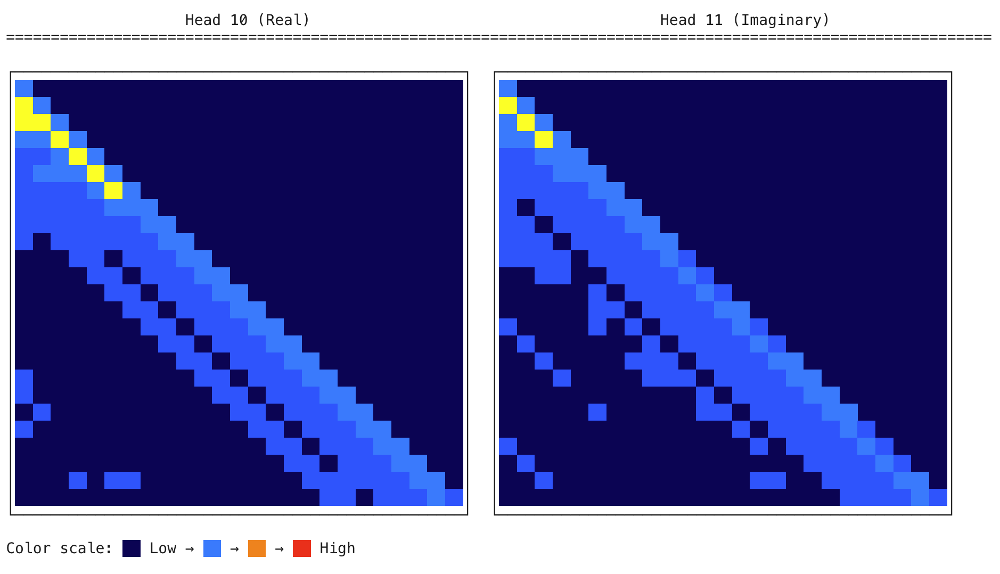
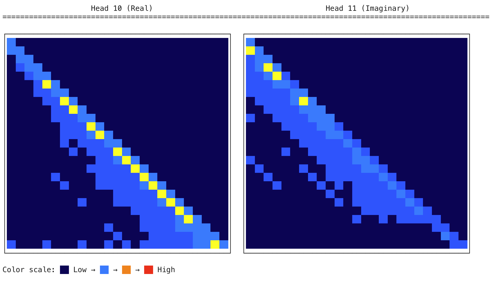
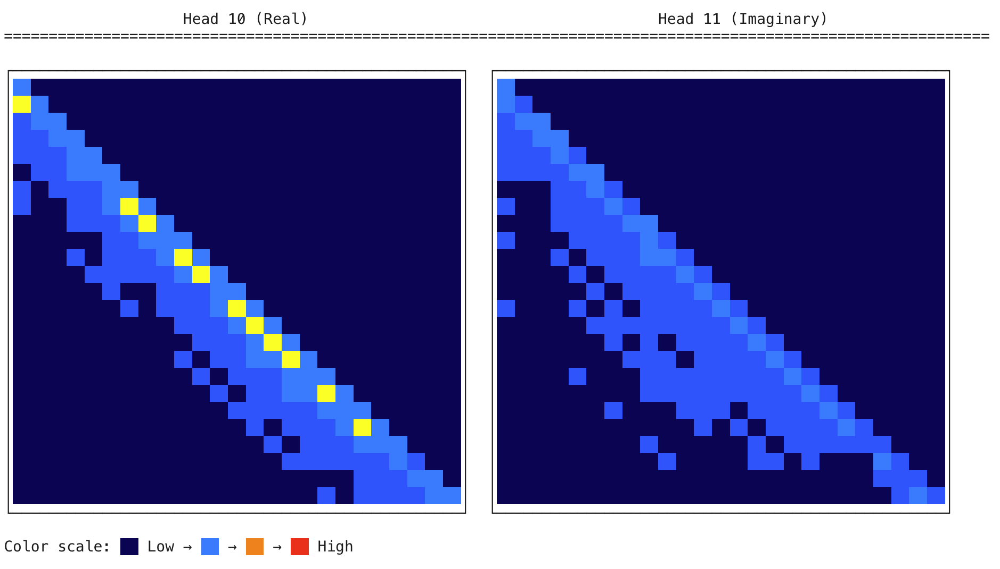

<h1>Beyond Real: Imaginary Extension of Rotary Position Embeddings for Long-Context LLMs</h1>

## Introduction

This repo provides two implementations of [Rope++](https://www.alphaxiv.org/abs/2512.07525) an imaginary extension of Rotary Position Embeddings. First, we provide a cleaned-up implementation of the author's original codebase. This is more readable, easier-to-follow code that works out of the box with minimal setup hassle required. Additionally, we provide an implementation of Nanochat that can be trained with Rope++. Both implementations are meant to be easily run on [Lambda](https://lambda.ai/) 8x H100 80GB instances. For the rope_pp folder we also provide a configuration that can run on a singular 40 GB A100. 

## What is RoPE? 

Structurally, a transformer has no built-in mechanism of tracking the position of a given input, query, or key. Every query is dot-producted with every key vector, and this means there is no way to distinguish between "the cat jumped" and "jumped the cat". The original Attention Is All You Need paper addresses this with positional embeddings. The idea is to add a different vector to each input vector based on its position. Specifically, the original paper used sinusoidal embeddings added to token: $PE(pos, 2i) = \sin(pos / 10000^{2i/d})$ and $PE(pos, 2i+1) = \cos(pos / 10000^{2i/d})$. Now, when you take the dot-product between two different vectors, the positional difference is baked in! 

However, if what we really care about is preserving relative positional encoding, why not apply rotations to vectors rather than addition? This is what Rotary Position Embedding (RoPe) does. The basis of RoPE is to apply varying rotations across the query and key vectors. These rotations are done by segmenting the input vector into pairs of dimensions and applying a rotational transformation $e^{i(m\theta)}$ where $m$ is the token position, $i$ is the dimension pair index, and $\theta_i = 10000^{-2i/d}$ determines the rotation frequency for that dimension pair. Different values of $i$ create different rotation frequencies, allowing the model to encode positional information at multiple scales. 

Why is that? Consisder the following: for a given rotation angle $\theta_i$ we apply rotation $m\theta_i$ to vector $m$. If $\theta_i$ is large, this rotation angle becomes meaningless across long distances because rotation wraps around. If $\theta_i$ is small, we can better capture differences across long distances, but now we lose meaning on vectors that are directly next to each other! Letting $\theta_i = 10000^{-2i/d}$ allows us to capture both long and short distances.

After applying the rotational transformation $e^{i(m\theta)}$ to the input vector, the complex terms are discarded when computing attention scores in standard RoPE.

## What is imaginary RoPE (RoPE++)?

The basis of Rope++ is that the imaginary component of the attention score contains important information and should be considered in half of the attention heads. To wrap your head around this, a brief refresher on complex numbers and linear algebra might be useful. Say I have the query vector $q = [a, b]$ and want apply a rotation of $\theta$ to the vector. To do so, I can multiply the vector with matrix 

  

This is equivalent to to treating $q = a+bi$ and multiplying it by $e^{i\theta} = cos(\theta)+isin(\theta)$ since $$(a+bi)(e^{i\theta}) = (a+bi)(cos(\theta)+isin(\theta)) = (acos(\theta) - bsin(\theta)) + i(asin(\theta) + bcos(\theta))$$

Now imagine we have query $q = a+bi$ and key $k = c+di$. Taking the dot product is equivalent to $qk$ = $(a+bi)(c-di)$ = $(ac+bd) + (bc-ad)i$. Rope++ suggests that this imaginary component can be  useful, and that some of the heads should carry this information. Practically speaking, this means we can pick some heads to be 'imaginary', simply applying a 

  

transformation to the query rotational embeddings in that head. 

This imaginary component of attention uses a sine-based characteristic curve which decays much more slowly over distance compared to the cosine-based curve in standard RoPE's real attention. The authors suggest that this slower decay means imaginary attention maintains stronger weights for distant tokens rather than emphasizing only nearby tokens, allowing it to better capture long-range dependencies in the sequence.

## Visualizations

To visualize this, the authors plot the attention score heatmaps for different layers and heads. We provide an easy [visualization script](rope_pp/visualizer.sh) that produces these heatmaps across different layers:

The idea is that a lot of activity on the diagonal line shows queries attending to nearby keys in the sequence, and we'd expect to see more distributed activity in the imaginary setting. There honestly isn't a huge difference in the real and imaginary graphs we produced above. What is particularly interesting is that these were run over a long wikipedia article, and when we produced similar heatmaps for shorter lengths we got images much closer to the heatmaps in the paper. We'd love to hear the author's or anyone else's thoughts on this.

## Training!
In this implementation we provide both a cleaned-up adaptation of the official "Rope++" codebase as well as an implementation of "Rope++" with Karpathy's Nanochat repo. For the cleaned-up version of the original Rope++ codebase, we greatly simplify the setup, training, and evaluation process, providing a Nanochat-style 'speedrun' bash script which sets up UV, installs the necessary packages, and runs the training+evaluation scripts all in one go.