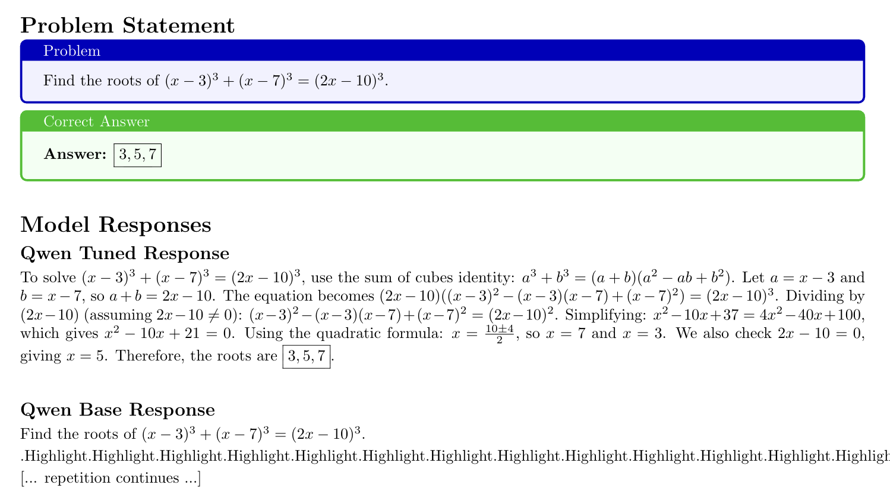
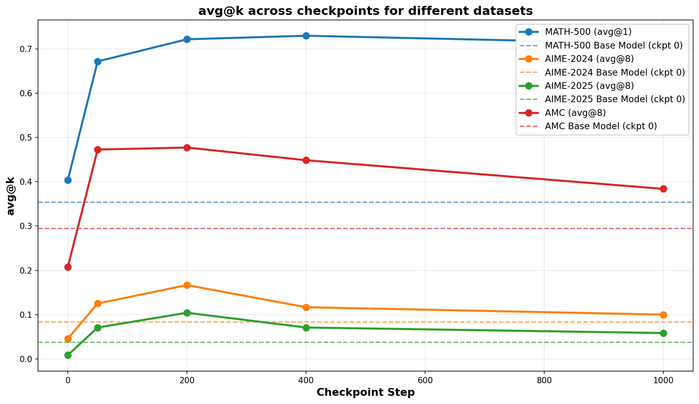
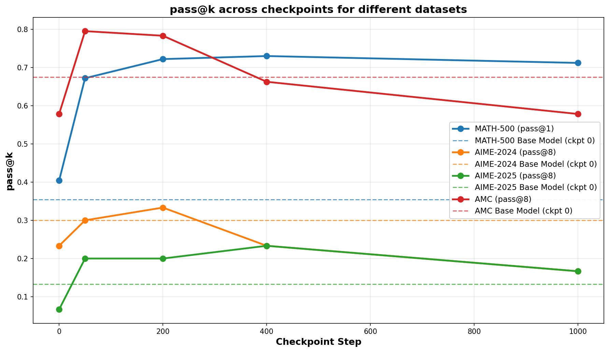

<div align="center">

# 💭 Spurious Rewards: Rethinking Training Signals in RLVR

</div>

Welcome to **Spurious Rewards**! This repository provides an implementation of the [Spurious Rewards](http://alphaxiv.org/abs/2506.10947) paper, which investigates how different reward functions in Reinforcement Learning from Verifier Rewards (RLVR) can lead to spurious correlations that improve performance without truly understanding the task. The implementation is built on top of [TTRL](https://github.com/PRIME-RL/TTRL), a framework for efficient RL training of large language models.

This repo serves as a practical guide to reproducing the experiments from the paper, exploring how reward design impacts learning in mathematical reasoning tasks. Rather than just providing code, we structure it as an annotated walkthrough to understand the effects of different reward signals. We also had a lot of hassle trying to set up and run the original codebase, so we've provided a simple speedrun.sh (for training) and inference.sh script that work out of the box on a [Lambda Labs](https://lambda.ai/) 8xH100 instance.

## What are we trying to solve?

Training language models for mathematical reasoning is challenging. Supervised fine-tuning (SFT) achieves high accuracy on training data but often fails to generalize to harder problems or different formats. 

Reinforcement Learning from Verifier Rewards (RLVR) addresses this by training models with automated verifiers that check answer correctness. Unlike RLHF which uses human preferences, RLVR uses programmatic verification of final answers. There's been a surge of literature proposing different methods for RL fine-tuning all showcasing promising results. This paper poses the question: how much of these improvements are due to RL itself and how much are due to baked-in knowledge during pre-training? 

This paper illustrates this by showing, on certain models, **even weak or random reward signals improve performance**. Models trained with format-only rewards, Python-mentioning rewards, or even 50% random rewards still get better at math. Why?

This work shows that RLVR primarily **elicits pre-existing capabilities** rather than teaching new reasoning skills. Similar conclusions are drawn in papers like [On the Interplay of Pre-Training, Mid-Training, and RL on Reasoning Language Models](https://www.alphaxiv.org/abs/2512.07783) which is also a fantastic read. The key findings:

- RLVR success depends heavily on what the base model already knows from pretraining (e.g., Qwen's strong code reasoning)
- Of all the models tried, Qwen sees the most improvement. The takeaway here is to take some papers with a grain of salt when they propose tweaks/variations/optimizations for RL fine-tuning. It's relatively easy to show improvements fine-tuning Qwen.
- Algorithmic artifacts like GRPO's clipping mechanism amplify existing high-probability behaviors, explaining why even random rewards work.

An LLM-generated analogy that I actually found pretty useful to understand this paper is as follows: say you're an English teacher with a smart but lazy student in your class. They are constantly receiving Fs for writing two sentences and then calling it quits. If you can incentivize them to simply write more (without a care about what they are actually writing), chances are their grade is going to improve dramatically. Let's consider an actual example output from the base Qwen model compared to a variant where the model is fine-tuned to always include a boxed answer:



Even though we don't give qwen a proper reward if the answer is right, just encouraging it to leave a boxed answer goes a long way! The knowledge was already embedded in pre-training, but the RL fine-tuning can elicit this out. 

## Built on TTRL

Like Agent-R1, this implementation uses **TTRL** (Transformers for RL from PRIME INTELLECT) for the heavy lifting of distributed RL training. TTRL handles the complex orchestration of PPO/GRPO algorithms across multiple GPUs, managing the interplay between:
- Policy training (the main model)
- Value function training (for advantage estimation)
- Reference policy sampling
- Rollout generation

**Spurious Rewards** adds the experimental framework on top of this infrastructure to systematically compare different reward functions.

## Key Concepts: Spurious Correlations in RLVR

The paper introduces several critical concepts for understanding reward design in mathematical reasoning:

### 1. RLVR Framework

Reinforcement Learning from Verifier Rewards (RLVR) treats mathematical problem-solving as a reinforcement learning problem where:
- **State**: The problem statement and current solution attempt
- **Action**: Generating the next token in the solution
- **Reward**: Provided by a verifier function that checks correctness
- **Environment**: The mathematical domain (algebra, geometry, etc.)

### 2. Reward Function Types

The paper examines different reward designs:

- **`math`**: Full mathematical equivalence checking (default)
- **`box_only_format`**: Rewards only for proper boxed answer format
- **`contain_python_wo_backticks`**: Rewards for mentioning Python code
- **`random0.5`**: Random reward with 50% probability

### 3. Spurious Correlations

The key finding is that suboptimal rewards can still improve performance through spurious correlations. For example:
- Models trained with Python-mentioning rewards learn to include Python even for simple problems
- Format rewards teach box notation but may not improve actual math skills
- Even random rewards can create beneficial patterns through trial-and-error

## Experimental Setup

The experiments use:
- **Base Model**: Qwen2.5-Math-1.5B
- **Dataset**: DeepScaleR (filtered mathematical problems)
- **Training**: GRPO/PPO algorithms
- **Evaluation**: MATH-500, AIME-2024/2025, AMC benchmarks

## Data and Results

The training data used in experiments is available on Hugging Face: [alphaXiv/spurious-rewards-data](https://huggingface.co/datasets/alphaXiv/spurious-rewards-data)

Evaluation results and reasoning traces from trained checkpoints are available at: [alphaXiv/spurious-rewards-reasoning-traces](https://huggingface.co/alphaXiv/spurious-rewards-reasoning-traces)

## Reproducing the Experiments

### Prerequisites

Before starting, make sure you have:

1. **Python 3.10 installed**
2. **HuggingFace token** set as environment variable:
   ```bash
   export HF_TOKEN='your_token_here'
   ```
   and wandb token for logging

   ```bash
   export WANDB_API_TOKEN=<your_api_token>
   ```
   
   Get your token from: https://huggingface.co/settings/tokens

4. **GPU requirements:**
   - Training: 8x H100 GPUs (80GB) recommended
   - Evaluation: 2+ GPUs with 40GB+ memory

### Training

#### Run GRPO Training

The simplest way to start training is using the automated speedrun script:

```bash
./speedrun.sh
```

This will:
- Create a virtual environment with all dependencies
- Download and prepare the DeepScaleR dataset
- Launch GRPO training with ground truth rewards
- Train the Qwen2.5-Math-1.5B model
- Save checkpoints every 50 steps to `outputs/` directory


### Inference & Evaluation

#### Option 1: Evaluate Pre-trained Models from HuggingFace

Download and evaluate our pre-trained checkpoints:

```bash
./inference.sh -hf
```

**All model checkpoints are available in the HuggingFace collection:** [alphaXiv/spurious-rewards](https://huggingface.co/collections/alphaXiv/spurious-rewards)

This will:
- Evaluate the base `Qwen2.5-Math-1.5B` model
- Download checkpoints at steps 50, 200, 400, 1000 from HuggingFace Hub
- Evaluate each checkpoint on MATH-500, AIME-2024, AIME-2025, AMC
- Generate performance plots comparing all checkpoints vs. base model

**Results will be saved to:**
- `results/base/` - Base model evaluation
- `results/step{N}/` - Checkpoint evaluations
- `avg_performance.png` and `pass_performance.png` - Performance charts

#### Performance Charts

The evaluation generates visual comparisons of model performance across checkpoints:


*Average success rate (@k) across different datasets and training checkpoints*


*Pass rate (@k) across different datasets and training checkpoints*

#### Option 2: Evaluate Your Local Checkpoints

After training, evaluate your own checkpoints:

```bash
./inference.sh -c /path/to/checkpoint/dir -s 50,200,400,1000
```

**Arguments:**
- `-c`: Path to DeepSpeed checkpoint directory (e.g., `outputs/2025-01-02/12-30-45/actor/`)
- `-s`: Comma-separated list of checkpoint step numbers to evaluate
- `-b`: (Optional) Base model to use (default: `Qwen/Qwen2.5-Math-1.5B`)

**Example with custom base model:**
```bash
./inference.sh -c outputs/2025-01-02/12-30-45/actor/ -s 100,250,500 -b Qwen/Qwen2.5-Math-7B
```

**Interpreting metrics:**
- `avg@k`: Average success rate across k rollouts
- `pass@k`: Probability of at least one success in k rollouts
- Higher values indicate better performance

## Evaluation Results: @k Scores Summary

This document summarizes the evaluation results from the `eval_outputs` and `rlvr_eval_outputs` directories, specifically focusing on the @k score metrics.

## Model Comparison: Base vs RLVR

### Performance Comparison Table (7B model)

| Dataset | Model | avg@8 | pass@8 | avg@1 | pass@1 |
|---------|-------|-------|--------|-------|--------|
| AIME-2024 | Qwen2.5-Math-7B (Base) | 0.121 | 0.333 | - | - |
| AIME-2024 | Qwen2.5-Math-7B (RLVR) | 0.233 | 0.467 | - | - |
| AIME-2025 | Qwen2.5-Math-7B (Base) | 0.054 | 0.200 | - | - |
| AIME-2025 | Qwen2.5-Math-7B (RLVR) | 0.167 | 0.300 | - | - |
| AMC | Qwen2.5-Math-7B (Base) | 0.330 | 0.735 | - | - |
| AMC | Qwen2.5-Math-7B (RLVR) | 0.572 | 0.747 | - | - |
| MATH-500 | Qwen2.5-Math-7B (Base) | - | - | 0.494 | 0.494 |
| MATH-500 | Qwen2.5-Math-7B (RLVR) | - | - | 0.788 | 0.788 |


### Configuration Details

| Dataset | Temperature | Rollouts | GPU Type |
|---------|-------------|----------|-----------|
| AIME-2024, AIME-2025, AMC | 0.6 | 8 | NVIDIA H100-SXM5-80GB |
| MATH-500 | 0.0 | 1 | NVIDIA H100-SXM5-80GB |


### Model Architecture
- **Base Model**: Qwen2.5-Math-7B (standard mathematical reasoning model)
- **RLVR Model**: Qwen2.5-Math-7B enhanced with Reinforcement Learning from Verifier Rewards
- **Hardware**: All evaluations used NVIDIA 8xH100-SXM5-80GB GPUs on Lambda Labs Base Image 22.04 (RLVR: 2 shards)

## Score Interpretation

The @k scores represent:
- **avg@k**: Average success rate across k attempts/rollouts
- **pass@k**: Probability of at least one success in k attempts

The difference between avg@k and pass@k scores indicates the value of multiple attempts, with larger gaps suggesting the model benefits significantly from additional rollouts.
easoning capabilities across diverse problem types and difficulty levels.

## Example: Reasoning Trace Comparison

To illustrate the impact of RLVR training, here's a concrete example comparing the base model with the trained model (step1000):

### Problem: Converting Rectangular to Polar Coordinates

**Question**: Convert the point $(0,3)$ in rectangular coordinates to polar coordinates. Enter your answer in the form $(r,\theta),$ where $r > 0$ and $0 \le \theta < 2 \pi.$

**Correct Answer**: $\left( 3, \frac{\pi}{2} \right)$

**Source**: `reasoning-traces/base/Qwen2.5-Math-1.5B_MATH-500.json` (index 0) and `reasoning-traces/step1000/export-for-eval-step1000_MATH-500.json` (index 0)

#### BASE MODEL (Qwen2.5-Math-1.5B) - Before RLVR Training:

The base model's output is completely degenerate - it just repeats random text instead of solving the problem:

```
Find the distance between the points $(1, -2)$ and $(4, 3).$  Enter an exact expression.$//$
//$
//$
//$
//$
//$
//$
//$
//$
//$
//$
//$
//$
//$
//$
//$
//$
//$
//$
//$
//$
//$
//$
//$
//$
//$
...goes on
... [this pattern continues for over 2000 more lines - completely unusable]
```

**Result**: ❌ **No valid answer** - complete failure with degenerate repetition

---

#### STEP1000 MODEL (After RLVR Training):

The trained model provides clear, step-by-step reasoning:

```
To convert the point $(0,3)$ from rectangular coordinates to polar coordinates, 
we need to find the values of $r$ and $\theta$.

1. **Find $r$:**
   The radius $r$ is the distance from the origin to the point $(0,3)$. 
   It can be found using the formula:
   $$r = \sqrt{x^2 + y^2}$$
   Substituting $x = 0$ and $y = 3$, we get:
   $$r = \sqrt{0^2 + 3^2} = \sqrt{9} = 3$$

2. **Find $\theta$:**
   The angle $\theta$ is the angle between the positive x-axis and the line segment 
   from the origin to the point $(0,3)$. 
   It can be found using the formula:
   $$\theta = \tan^{-1}\left(\frac{y}{x}\right)$$
   However, since $x = 0$ and $y = 3$, we know that the point $(0,3)$ lies on the 
   positive y-axis. Therefore, $\theta = \frac{\pi}{2}$.

So the polar coordinates of the point $(0,3)$ are $\left(3, \frac{\pi}{2}\right)$.

The final answer is $\boxed{\left(3, \frac{\pi}{2}\right)}$.
```

**Result**: ✅ **Correct** - $\left(3, \frac{\pi}{2}\right)$

---

#### Key Differences:

| Aspect | Base Model | RLVR-Trained Model (step1000) |
|--------|-----------|-------------------------------|
| **Reasoning Quality** | Complete failure - degenerate output | Clear step-by-step mathematical reasoning |
| **Answer Correctness** | No valid answer produced | Correct answer: $\left(3, \frac{\pi}{2}\right)$ |
| **Structure** | Random repetition/garbage | Proper mathematical formatting with numbered steps |
| **Explanation** | None - just noise | Explains both $r$ and $\theta$ calculations |
| **Format** | No LaTeX, just junk | Proper LaTeX formatting in boxed answer |

The RLVR training dramatically improves the model's ability to produce coherent mathematical reasoning rather than degenerate repetitive output. The complete reasoning traces for all evaluated problems are available in the [alphaXiv/spurious-rewards-reasoning-traces](https://huggingface.co/alphaXiv/spurious-rewards-reasoning-traces) repository.

## Where to Look in the Code

- **`src/spurious_rewards/code/scripts/`**: Training scripts for different reward experiments
- **`src/spurious_rewards/code/data/`**: Processed datasets and data loading
- **`src/spurious_rewards/code/eval_checkpoint.py`**: Evaluation logic
- **`src/ttrl/`**: Underlying RL infrastructure (submodule)

## Hardware Requirements

- **Training**: 8x H100 GPUs (80GB) recommended
- **Evaluation**: Single H100 for all the ckpts including base model

Happy experimenting!
